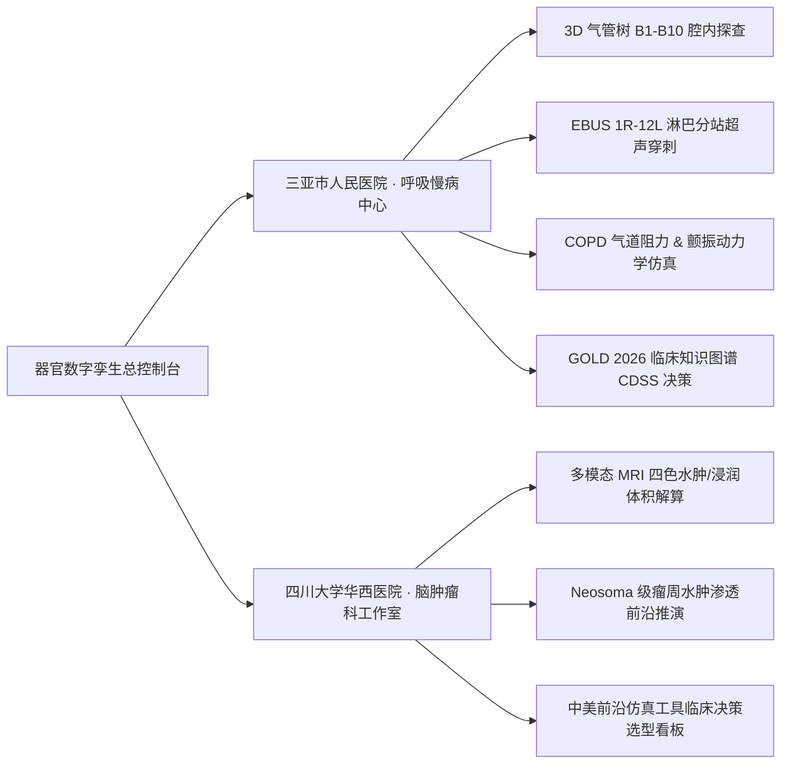

<div align="center">

# 🫁 人体数字孪生（肺部与多中心器官）临床交互系统
### Pulmonary & Multi-Organ Digital Twin Interactive System
*(Clinical & Supercomputing Edition · 临床医护 / 算法工程 / 慢病患者 / 质控复核 多端全景版)*

<p align="center">
  
  
  
  
  
  
  
</p>

<p align="center">
  <b>三亚市人民医院 (呼吸与危重症医学科)</b> ✕ <b>四川大学华西医院 (脑肿瘤科)</b> ✕ <b>三亚学院 (超算与数字孪生重点实验室)</b><br/>
  联合构建的面向量算闭环、AI 临床决策辅助与慢病居家康复的全周期数字孪生平台
</p>

[✨ 核心功能亮点](#-核心功能亮点) • 
[🖥️ 电脑看板与手机模拟](#️-电脑端全景看板--手机真机模拟器双模架构) • 
[🏥 双中心数字孪生](#-跨院区双中心器官数字孪生架构) • 
[🚀 快速启动](#-部署与快速启动指南) • 
[🔑 体验演示账号](#-五类角色预置演示账号) • 
[📁 工程目录](#-完整项目工程目录树)

---

</div>

## 📌 项目概述

本系统严格遵循国家医疗大模型与数字孪生前沿临床规范，覆盖**胸部薄层 CT 影像四步 AI 分割体重建**、**支气管树 B1-B10 各解剖段**、**IASLC 1R-12L 超声支气管镜 (EBUS) 淋巴结定位**、**CFD 流体力学仿真**以及**慢病患者居家 7×24h 智能预警与康复打卡**。

系统全面支持【**电脑端宽屏全景健康看板**】与【**iPhone 16 Pro 手机真机模拟器**】在界面右上角一键无缝自由切换，并横跨**海南三亚市人民医院 (COPD 呼吸慢病)** 与 **四川大学华西医院 (神经外科脑胶质瘤孪生)** 双中心临床业务。

---

## 🖥️ 电脑端全景看板 / 手机真机模拟器双模架构

针对慢病患者与家属端，彻底告别单调留黑边，提供全网领先的双模交互体验：

| 交互形态 | 视口展示模式 | 核心设计与临床业务能力 |
| :--- | :--- | :--- |
| **🖥️ 电脑端全景健康看板**<br/>*(Desktop Patient Portal)* | 宽屏自适应两栏布局<br/>(占比 45% : 55%) | • **左侧主力区**：大尺寸 3D 翡翠健康微光数字肺，支持 360° 自由旋转/缩放、18次/分呼吸舒张收缩动效、清透气流呼吸粒子流；发光环形微仪表盘显示 **84 / 100 分**（良好）；三亚海棠湾温湿度天气；7×24h 智能预警防护条。<br/>• **右侧管理区**：实时静息血氧 (96%)、心率 (74bpm)、呼吸频率 (18次/分) 及过去 7 天平滑面积波动曲线；今日吸入剂用药打卡与倒计时；可视化呼吸节拍引导器（吸气4s➔屏气2s➔慢呼气6s）；王主任随访留言与紧急直连医生 (SOS) 调度台。 |
| **📱 手机真机模拟器**<br/>*(Mobile Simulator)* | iPhone 16 Pro 金属拉丝边框<br/>+ 居中灵动岛 (Dynamic Island) | • 仿真高品质移动端视口，内部完整运行《呼吸健康伴侣 · 患者端》。<br/>• 底部 5 大核心 Tab：`[🫁 肺视界]`、`[📋 今日任务]`、`[🔔 智能预警]`、`[💬 医患随访]`、`[🚨 急救SOS]`。<br/>• 支持接收医生端下发的调药处方并一键确认同步至打卡闭环，支持生成内网二维码真机扫码体验。 |

> **无缝模式切换**：在界面右上角通过药丸切换器 `[🖥️ 电脑端全景看板]` / `[📱 手机真机模拟]` 即可随时一键切换，并支持与左侧 8 项业务菜单实时联动！

---

## 🏥 跨院区双中心器官数字孪生架构

系统内置双中心一键无缝热切换能力：



### 1. 三亚市人民医院（呼吸科 / COPD 数字孪生中心）
- **高精半透明解剖结构**：主气管、左右主支气管、叶段支气管 B1-B10，病变狭窄段（RB3）呼气相剧烈气道颤振（Airway Fluttering）；
- **虚拟支气管镜 (Virtual Bronchoscopy)**：管腔内壁透视、管壁红肿水肿与分泌物模拟；
- **IASLC 1R-12L EBUS 探查**：气管、奇静脉弓、升主动脉、肺动脉与上腔静脉空间毗邻及超声回声特征；
- **COPD 全周期推演**：模拟三联吸入药物（LABA+LAMA+ICS）干预下 6~24 个月 FEV1 与气道阻力改善趋势。

### 2. 四川大学华西医院（脑肿瘤科 / 脑胶质瘤数字孪生工作室）
- **多模态 MRI 体积多色渲染**：对比增强肿瘤区（Enhancing Tumor）、瘤周水肿带（Edema）、坏死核心（Necrosis）、非增强肿瘤成分；
- **水肿浸润深度分析**：计算浸润侵袭前沿（Infiltration Margin）与皮层功能区（运动区/语言区）的距离；
- **中美主流数字孪生仿真系统决策选型看板**：深度对比华西自主研发系统与西门子、FEI、Neosoma 的临床实用性与科研选型指标。

---

## ✨ 核心功能亮点

| 模块名称 | 临床/技术特性 | 用户体验 |
| :--- | :--- | :--- |
| **3D 肺孪生阅片视界** | Three.js WebGL2 PBR 物理渲染，次表面散射材质（SSS），支持正位、侧位、仰视全角度观察。 | 鼠标自由旋转/缩放，呼吸节律自然律动。 |
| **CT 影像导入与重建** | 4 步 AI 多尺度分割重建流水线（体素提取 ➔ 气道拓扑平滑 ➔ 肺叶封装 ➔ 仿真绑定）。 | 实时进度反馈与三维切片预览。 |
| **10Hz 呼吸时序推流** | WebSocket 高频实时推送气道压 $P_{aw}$、流速 $V'$、顺应性 $C_{rs}$、阻力 $R_{aw}$ 双曲线波形。 | ECharts 平滑动态面积图，毫秒级响应。 |
| **知识图谱 CDSS 决策** | 基于 Neo4j 图数据库，融合 GOLD 2026 指南阶梯推理，提供 AECOPD 72h 风险评估与调药闭环。 | 临床证据链可追溯，一键下发处方。 |
| **多角色 RBAC 隔离** | 严格区分主治医师、算法工程师、质控复核员、患者及家属、合规法务 5 类角色专属工作台。 | 顶栏一键切换角色体验，数据安全物理隔离。 |
| **区块链级合规审计** | SHA-256 哈希链记录医师会诊、参数调优、处方下达与质控签批，防篡改验真。 | 完整医疗法律凭证，合规可溯。 |

---

## 🔑 五类角色预置演示账号

系统在界面顶栏提供**“演示账号便捷切换栏”**，点击对应角色卡片即可直接切换，亦可通过传统登录窗口登录：

> 🔐 **全局演示密码**：`TwinAdmin2026!`

| 角色中文名称 | 用户名 (`username`) | 预置姓名与职称 | 专属工作台与核心能力 |
| :--- | :--- | :--- | :--- |
| **呼吸科临床主治医师** | `dr_wang` | 王主任 (主任医师/教授) | 3D肺阅片、CT重建、内窥镜、EBUS分站、病变标注、病情推演、CDSS决策、EHR全景 |
| **慢病患者及家属** | `patient_chen` | 张老伯 / 陈家属 | **【电脑端全景看板】与【手机真机模拟】一键切换**、3D健康肺、用药打卡、缩唇呼吸操、紧急SOS |
| **数字孪生算法工程师** | `eng_zhang` | 张工 (仿真工程师) | 网格拓扑、LOD0/1/2多尺度调度、PyBullet力学微调、CFD流体动力学、WebGL 60 FPS Profiler |
| **临床诊疗质控员** | `reviewer_li` | 李质控 (副主任医师) | 双盲诊疗方案复核（92.4%一致率）、GOLD合规审查、XAI可解释性推理、质控报告CA签批 |
| **医患合规法务员** | `legal_zhao` | 赵法务 (合规总监) | 敏感隐私脱敏专线审查、医疗操作全链路追溯、SHA-256 区块链防篡改验真 |

---

## 🚀 部署与快速启动指南

### ⚡ 极速启动（Windows 双击即开 · 推荐）
直接在项目根目录双击运行 [`start.bat`](start.bat)：
- 自动检测并展示本地局域网 IP；
- 并行拉起 Flask 后端（5000 端口）与 Vite 前端（3000 端口）；
- 自动在终端绘制 ASCII 二维码，手机直接扫码即可在真机上体验！

---

### 方式 1：本地极速开发与调试运行（无 Docker 依赖）
> 本系统内置**高可用模拟代理（Mock Fallback）**，即便本地未安装 MySQL 或 Neo4j 实体服务，前端与后端亦可即时启动并顺畅运转！

#### 1. 启动后端 (Flask + SocketIO)
```bash
# 1. 打开终端进入后端目录
cd backend

# 2. 安装 Python 核心依赖 (推荐 Python 3.10+)
pip install -r requirements.txt

# 3. 启动后端服务
python app.py
```
> 控制台输出：`监听地址: http://0.0.0.0:5000` | `WebSocket: ws://0.0.0.0:5000/socket.io`

#### 2. 启动前端 (Vite + React)
```bash
# 1. 打开新终端进入前端目录
cd frontend

# 2. 安装前端 npm 依赖
npm install

# 3. 启动 Vite 开发热更新服务器
npm run dev
```
> 控制台输出：`Local: http://localhost:3000/`，在浏览器打开即可进入系统！

---

### 方式 2：Docker Compose 一键容器化部署（全栈生产模式）
```bash
# 1. 在项目根目录下一键构建并启动 6 大微服务容器
docker-compose up -d --build

# 2. 检查各容器健康状态
docker-compose ps
```
> 容器启动完成后，MySQL、Neo4j、MongoDB 将自动执行 `database/` 下的初始化脚本，并在 `http://localhost:8080` 开放访问。

---

## 🌐 系统访问端点清单

| 访问入口 | 地址 URL | 说明 |
| :--- | :--- | :--- |
| **系统综合访问门户** | `http://localhost:3000/` | 自动根据屏幕识别，默认进入自适应临床工作站 |
| **慢病患者端电脑宽屏看板** | `http://localhost:3000/` 切换为患者角色 | 默认展示宽屏大尺寸 3D 肺与综合体征看板 |
| **慢病患者端手机模拟器** | 右上角点击 `[📱 手机真机模拟]` | iPhone 16 Pro 拟态仿真体验 |
| **真机扫码访问** | `http://<局域网IP>:3000/` | 手机连接同 Wi-Fi 即可全功能触控体验 |
| **后端 RESTful API** | `http://localhost:5000/api/` | 临床数据、患者指标与决策推演接口 |
| **后端 WebSocket 实时推流** | `ws://localhost:5000/socket.io/` | 10Hz 呼吸力学与体征时序推流 |
| **Neo4j 图数据库控制台** | `http://localhost:7474/` | 用户名: `neo4j`，密码: `TwinAdmin2026!` |

---

## 📁 完整项目工程目录树

```text
f:/数字孪生项目/
├── backend/                               # 后端服务 (Python 3.10 + Flask + SocketIO + Celery)
│   ├── app.py                             # 主应用入口、WebSocket 10Hz 时序推流与路由装载
│   ├── config.py                          # 混合数据库与双超算集群连接配置
│   ├── requirements.txt                   # Python 核心依赖清单
│   ├── Dockerfile                         # 后端 Docker 镜像构建文件
│   ├── models/                            # 异构数据库数据模型定义 (MySQL + Mongo + Neo4j)
│   ├── routes/                            # RESTful API 蓝图控制器
│   │   ├── auth_routes.py                 # 用户认证与五角色体验切换接口
│   │   ├── clinical_routes.py             # 病例查询、DICOM特征、病变标注与处方
│   │   ├── simulation_routes.py           # CFD流体参数微调、时序波形与超算负载监控
│   │   ├── graph_routes.py                # 气道知识图谱、EBUS镜下细节与狭窄路径
│   │   └── audit_routes.py                # 医疗合规审计、哈希链验真与脱敏专线态势
│   └── services/                          # 核心业务与生理仿真解算层
│       ├── desensitization_proxy.py       # 院内敏感数据脱敏流控代理
│       ├── physiological_simulation.py    # 4D 呼吸动力学、COPD气道阻力与颤振解算
│       ├── knowledge_graph_service.py     # 临床解剖知识图谱查询与狭窄推理
│       └── audit_service.py               # 区块链式 SHA-256 防篡改审计流水
├── frontend/                              # 前端工程 (React 18 + Vite + TS + Three.js + Tailwind)
│   ├── src/
│   │   ├── App.tsx                        # 多角色主工作区调度与全局状态中心
│   │   ├── components/                    # 通用组件与临床业务模块
│   │   │   ├── 3d/TwinViewer3D.tsx        # 医生端 3D 支气管树与 EBUS 视口
│   │   │   ├── navigation/                # 侧边栏多中心菜单导航组件
│   │   │   └── common/                    # 顶栏、架构图弹窗、扫码弹窗、错误边界
│   │   └── views/                         # 各角色专属业务工作台视口
│   │       ├── patient/                   # 【患者及家属端】核心目录
│   │       │   ├── PatientWorkbench.tsx   # 双模调度主入口
│   │       │   ├── PatientDesktopPortal.tsx # 电脑端宽屏全景健康看板
│   │       │   ├── PatientMobileSimulator.tsx # 手机真机模拟器
│   │       │   └── components/            # 大尺寸 3D 肺视界与模式切换药丸
│   │       ├── doctor/                    # 呼吸科主治医师 8 大业务视口 (阅片/CT/EBUS/CDSS等)
│   │       ├── brain/                     # 华西脑肿瘤数字孪生工作室 (MRI体积解算/3D视界)
│   │       ├── engineer/                  # 数字孪生算法工程师工作台
│   │       ├── reviewer/                  # 临床质控员复核工作台
│   │       ├── mobile/                    # 移动端 APP 核心视图组件
│   │       └── research/                  # 医院超算科研驾驶舱
├── database/                              # 数据库初始化架构脚本 (MySQL, Neo4j, Mongo)
├── docker-compose.yml                     # 全套微服务一键编排配置
├── nginx.conf                             # Nginx 自适应路由重写与反向代理
├── start.bat                              # Windows 一键全自动启动脚本 (含局域网IP与终端二维码)
└── README.md                              # 项目技术架构与访问操作手册
```

---

## 🗄️ 异构混合数据库设计架构

| 数据库引擎 | 核心职责 | 存储实体与集合 | 关键业务逻辑 |
| :--- | :--- | :--- | :--- |
| **MySQL 8.0** | 关系型主库 / RBAC / 审计 | `sys_user`, `sys_role`, `audit_log`, `patient_meta` | 细粒度操作控制、链式 SHA-256 防篡改审计记录，保证医疗合规。 |
| **Neo4j 5.x** | 临床解剖知识图谱 | 节点: `Bronchus`, `LymphNode`, `Lobe`<br/>关系: `BRANCHES_TO`, `ADJACENT_TO` | 支气管分叉拓扑（主气管→左右主支气管→B1-B10），1R-12L 淋巴结毗邻关系与狭窄波及推理。 |
| **MongoDB 6.0** | 仿真时序帧与半结构化文档 | `simulation_frames`, `dicom_features`, `ai_evaluations` | 存储 4D 呼吸周期形变压降时序、CT 体素密度云特征（LAA-950%）及 BioMedLM 大模型报告。 |
| **Redis 7.0** | 高速缓存与异步消息中间件 | Celery 任务队列、WebSocket 推流缓存 | 承载气道流体力学 Navier-Stokes CFD 方程解算任务调度。 |

---

## 📄 许可证说明

本项目遵循 **MIT License** 开源授权协议。  
数字孪生仿真解算模型与医疗知识图谱数据仅供科研与临床教学使用，实际诊疗方案请遵医嘱。

<div align="center">
  <p><b>人体数字孪生（多中心器官）联合项目组</b><br/>
  © 2026 Sanya People's Hospital & West China Hospital & Sanya University. All Rights Reserved.</p>
</div>